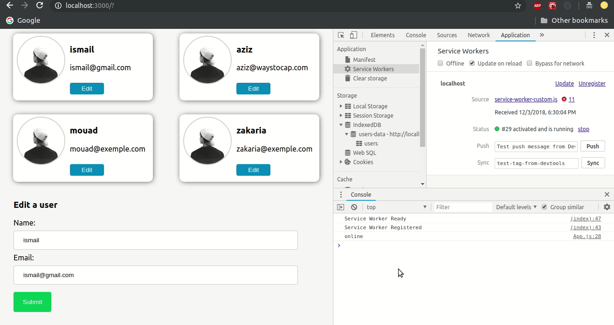

## Offline Sync

This project is an example of using Service Workers ina React app to cache data for offline use and
using background Sync to send any data the user requested when there is connectivity again 

## Demo

### Explanation

The backend is a simple NodeJS server that handle a GET and a PUT request to fetch and 
edit a collection of profiles data. (there was no need to use express since it's a simple server)

The front is a React app created with create-react-app and uses service workers for offline user experience.

the app will cache all the app pages as well as any data fetched from the server in order to display them when offline.

In the code you will see in App.js (in the componentDidMount function ) that there is two method for fetching profiles data :
    1. if the user is online we will fetch the data from the server, if not we will fetch from the      cache,this is useful for apps that require a real-time synchronization with the data in the      server.
    2. fetching from the cache first then going to the network to fetch from the server,
        this is useful if the user can have low connectivity, so we will display data from the cache first then when the data comes from the server we will update the page

I'm using the first method for simplicity.

## Background Sync

The user can edit profiles even if he's offline using the Background Sync Api of Service Workers:
if the user is offline we will store the profiles data in indexedDB and then when he's online again
we will fetch all the users that need to be updated and send them to the server.

## Running the project

### Prerequisites 
Node version 8.10 or later, npm version 3.5 or later
Since Service Workers works only with https we need a way to fetch the profiles data from the local server through https, I'm using [ngrok](https://ngrok.com/) for that, feel free to use whatever comfortable for you.

In the root directory type `node server.js` to start the server and if you are using ngrok type 
`ngrok http 8080` to access the local server through https, you will see the https link in the console, you should take it and replace the variable `apiUrl` in the front/App.js with it , do the same for the variable `apiHost` in front/public/sevice-worker-custom.js

Go the front directory and type `npm install` and then `npm start` and Enjoy!
